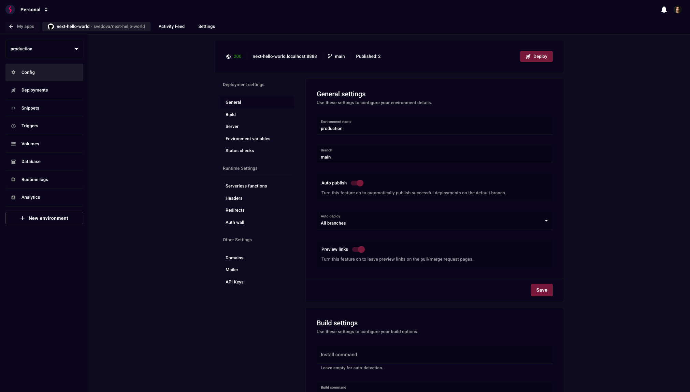

# Stormkit

Deploy your app and get the pieces it needs — a Postgres database, end-user
authentication, a transactional mailer, scheduled jobs and analytics — on
infrastructure you own.

```bash
curl -sSL https://www.stormkit.io/install.sh | sh
```

That is a working Stormkit on your own server: git push to deploy, a preview URL
per branch, custom domains with automatic TLS.



## What you get

| | |
| --- | --- |
| **Deployments** | Git push, UI, zip upload or API. A [preview URL per branch](https://www.stormkit.io/docs/deployments/auto-deployments), [environments](https://www.stormkit.io/docs/features/multiple-environments) with their own config, [status checks](https://www.stormkit.io/docs/deployments/status-checks) before publishing |
| **Any language** | Runtimes come from [mise](https://mise.jdx.dev) — Node.js, Go, Python, Ruby and anything else it supports. System packages from a `flake.nix`. A [start command](https://www.stormkit.io/docs/deployments/application-runtime) runs a long-lived server in any language |
| **Database** | [PostgreSQL](https://www.stormkit.io/docs/features/database) attached to an environment, with migrations run on deploy |
| **Authentication** | [Stormkit Auth](https://www.stormkit.io/docs/features/authentication) for your end users — email and password, magic links, Google and X — with sessions handled for you |
| **Email** | A [transactional mailer](https://www.stormkit.io/docs/features/mailer) wired to your SMTP provider |
| **Scheduled jobs** | [Periodic triggers](https://www.stormkit.io/docs/features/periodic-triggers), without a separate cron box |
| **Analytics** | [Server-side analytics](https://www.stormkit.io/docs/features/analytics) that do not depend on client-side tracking |
| **Also** | [Volumes](https://www.stormkit.io/docs/features/volumes), [serverless API routes and SSR](https://www.stormkit.io/docs/features/writing-api), [redirects and rewrites](https://www.stormkit.io/docs/features/redirects-and-path-rewrites), [custom headers](https://www.stormkit.io/docs/features/custom-headers), [snippet injection](https://www.stormkit.io/docs/features/snippets), [Auth Wall](https://www.stormkit.io/docs/features/auth-wall), [teams and roles](https://www.stormkit.io/docs/features/teams-and-roles) |

## Let an agent run it

Stormkit exposes the whole platform over [MCP](https://www.stormkit.io/docs/api/mcp),
so a coding agent can provision a server, deploy, publish and read the logs when
something breaks — without you opening the dashboard.

```bash
curl -sSL https://www.stormkit.io/install.sh | sh -s -- --agent
```

The `--agent` install is hands-off: give it an SSH key and it provisions the
instance, creates the owner account and mints an MCP-ready API key.

Your app can be on the other side of that too. The
[OAuth 2.1 server](https://www.stormkit.io/docs/features/oauth-server) turns an
app you host into an authorization server, so MCP clients like Claude and
ChatGPT connect to it as your end users rather than through a shared token.

## Cloud or self-hosted

[**Stormkit Cloud**](https://app.stormkit.io) is the managed option — deployments,
previews, domains, mailer, triggers and analytics, with nothing to operate.

**Self-hosted** runs on your own infrastructure and is where the full platform
lives: the database, Stormkit Auth, the OAuth 2.1 server and long-lived
application runtimes are self-hosted only. Docker images:

```
ghcr.io/stormkit-io/workerserver:latest
ghcr.io/stormkit-io/hosting:latest
```

A PostgreSQL database and a Redis instance are required alongside them.
See the [self-hosting guide](https://www.stormkit.io/docs/self-hosting/getting-started).

## Documentation

[www.stormkit.io/docs](https://www.stormkit.io/docs) — or read it in this repo
under [`docs/`](./docs).

## License

Open core. The Community Edition in [`src/ce/`](./src/ce) is AGPL-3.0. Enterprise
Edition components in [`src/ee/`](./src/ee) are commercially licensed. See
[LICENSE](./LICENSE).

## Contributing

Bug reports and pull requests are welcome. See [CONTRIBUTING.md](./CONTRIBUTING.md)
and the local development setup below.

## Local Development

To run Stormkit locally:

### Prerequisites

- Go 1.21+
- Node.js 22+
- PostgreSQL 14+
- Redis 7+
- [Mise](https://mise.jdx.dev/)
- [Docker](https://docs.docker.com/get-started/get-docker/)

You can install `go` and `node` using Mise, which is a polyglot tool version manager.

```bash
# Trust the dependencies specified in `mise.toml` and install them
mise trust && mise install
```

### Running the services

```bash
# Clone the repository
git clone https://github.com/stormkit-io/stormkit-io.git
cd stormkit-io

# Start all services (includes database setup and migrations)
make dev
```

After starting the services:

- The landing page will be available at `https://localhost:5500`
- The application will be available at `https://localhost:5400`
- The API will be available at `http://api.localhost:8888`

## Project Structure

```
stormkit-io/
├── src/
│   ├── ce/                   # Community Edition (AGPL-3.0)
│   │   ├── api/              # REST API server
│   │   ├── hosting/          # Hosting service
│   │   ├── runner/           # Build and deployment runner
│   │   └── workerserver/     # Background job processing
│   ├── ee/                   # Enterprise Edition (Commercial)
│   │   ├── api/              # Enterprise API features
│   │   ├── hosting/          # Enterprise hosting features
│   │   └── workerserver/     # Enterprise background services
│   ├── lib/                  # Shared libraries and utilities
│   ├── migrations/           # Database migrations
│   ├── mocks/                # Test mocks and fixtures
│   └── ui/                   # Frontend React
│   └── www/                  # Landing page React
├── scripts/                  # Build and deployment scripts
```

### Component Overview

- **Community Edition (`src/ce/`)**: Open source components under AGPL-3.0
- **Enterprise Edition (`src/ee/`)**: Commercial features requiring a license
- **Shared Libraries (`src/lib/`)**: Common utilities used by both editions
- **Frontend (`src/ui/`)**: React-based web interface

## Testing

Tests require PostgreSQL with a test database named `sktest` and Redis to be running.

### Setup

```bash
# Start services
docker compose up -d db redis

# Create test database
docker compose exec db createdb -U ${POSTGRES_USER} sktest
```

### Running Tests

```bash
# Run backend and frontend tests
make test

# Run only backend tests
make test-be

# Run only frontend tests
make test-fe
```

### Generating mocks

When adding or changing interfaces under `src/lib` (or other packages) we generate testify mocks using mockery so tests can inject fakes.

Recommended command (run from the repository root):

```bash
# generate mocks for all interfaces in the repo that require the alibaba and imageopt build tags
mockery --case=underscore --dir ./ --tags=alibaba,imageopt --all --output=./src/mocks
```

Notes:

- You can run mockery via `go run` if you don't want to install the binary globally:

```bash
go run github.com/vektra/mockery/v2@latest --case=underscore --dir ./ --tags=alibaba,imageopt --all --output=./src/mocks
```

- If you need expecter helpers for testify, add `--with-expecter` to the command.
- Use `--case=underscore` to match repository naming conventions for generated files.
- After regenerating mocks, run `gofmt`/`go vet` and `go test ./...` and commit the updated files under `src/mocks`.

## Troubleshooting

For detailed troubleshooting steps, see our dedicated [troubleshooting guide](./docs/troubleshooting.md).
